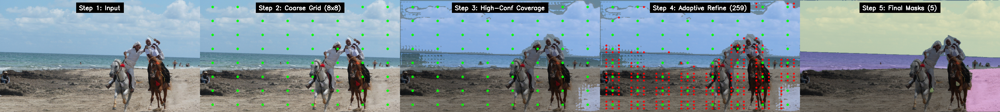
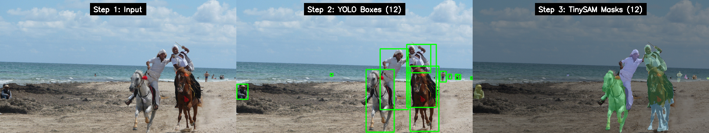
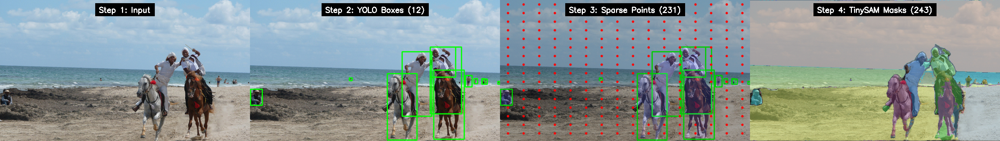
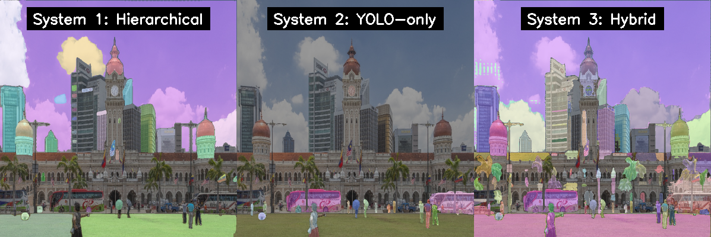
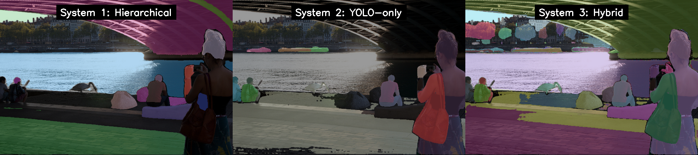
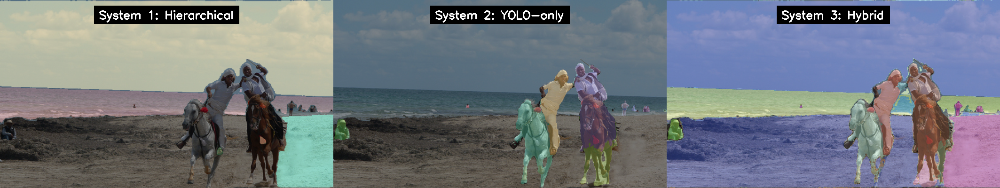

# YOLO + TinySAM Hybrid Instance Segmentation

Research implementation combining YOLOv12 object detection with TinySAM (efficient Segment Anything Model) for instance segmentation on COCO dataset.

## Overview

This repository implements and evaluates **three segmentation approaches**:

1. **Hierarchical Baseline**: TinySAM's adaptive two-stage point sampling (class-agnostic)
2. **YOLO-only**: YOLOv12 boxes → TinySAM segmentation (fast, category-aware)
3. **Hybrid** ⭐: YOLO for foreground + sparse points for background (balanced)

### System Comparison

| System | Latency | Masks/Image | Decoder Calls | Coverage | Speed |
|--------|---------|-------------|---------------|----------|-------|
| Hierarchical | ~31-44s | 5-15 | 9-12 | High AR/mIoU | ❌ Slow |
| YOLO-only | ~0.4-0.6s | 12 | 12 | Misses background | ✅ Very Fast |
| Hybrid | ~6-8s | 167-243 | 167-243 | Balanced | ⚖️ Balanced |

## Pipeline Visualizations

### Three Approaches Compared

<p align="center">
  
  <br><i>Hierarchical Baseline: Dense point grid with adaptive refinement</i>
</p>

<p align="center">
  
  <br><i>YOLO-only: Fast object-centric segmentation</i>
</p>

<p align="center">
  
  <br><i>Hybrid (Ours): YOLO for foreground + sparse points for background</i>
</p>

### Visual Comparison

<p align="center">
  
  <br><i>Side-by-side comparison of segmentation results</i>
</p>

### Why Hybrid is Superior

**1. ⚡ 3-8× Faster than Hierarchical**  
By using YOLO to detect salient foreground objects first, we avoid expensive dense point sampling across the entire image. Sparse points only fill in the gaps.

**2. 🎯 Better Coverage than YOLO-only**  
YOLO excels at prominent objects but misses small items, textures, and background elements. Our sparse point sampling captures these missed regions without sacrificing category information.

**3. 🧠 Smart Resource Allocation**  
- YOLO handles ~12 high-confidence objects (with category labels)
- Sparse points focus on the remaining ~155-230 uncovered regions  
- Total: ~167-243 decoder calls vs. hierarchical's thousands of dense grid points

**4. 🔄 Zero Redundancy**  
The coverage mask ensures we never segment the same region twice. Sparse points are only sampled where YOLO hasn't already provided coverage.

**5. 📊 Balanced Performance**  
Achieves competitive AR/mIoU metrics (comparable to hierarchical) while maintaining practical inference speed (6-8s vs 31-44s).

**The Bottom Line**: Hybrid combines the speed of detector-guided segmentation with the completeness of dense sampling, without the computational overhead of either extreme.

## Architecture

### TinySAM Model
- **Image Encoder**: TinyViT backbone (2.6M params, 42 GFLOPs)
  - Efficient window attention + MBConv blocks
  - Computes 256-channel embeddings at 64×64 resolution
- **Prompt Encoder**: Converts point/box prompts to sparse embeddings
- **Mask Decoder**: Two-way transformer for mask prediction
- **Performance**: 42.3% AP on COCO (comparable to SAM-B)

### YOLOv12 Detector
- Model: `yolov12s_turbo.pt` (9.1M params, 19.4 GFLOPs, 2.42ms)
- Provides bounding boxes + class labels for 80 COCO categories

## Installation

### Prerequisites
```bash
conda create -n mlre python=3.9
conda activate mlre
```

### Install Dependencies
```bash
# YOLOv12
cd yolov12
pip install -r requirements.txt
pip install -e .

# TinySAM
cd ../TinySAM
pip install torch torchvision
pip install opencv-python matplotlib pycocotools
```

### Download Weights

**TinySAM** (place in `TinySAM/weights/`):
- [tinysam_42.3.pth](https://github.com/xinghaochen/TinySAM/releases/download/3.0/tinysam_42.3.pth) (80MB)

**YOLOv12** (place in `weights/`):
- [yolov12s_turbo.pt](https://github.com/sunsmarterjie/yolov12/releases/download/turbo/yolov12s.pt) (36MB)

**COCO Dataset** (optional, for evaluation):
- [val2017 images](http://images.cocodataset.org/zips/val2017.zip) (1GB) → `TinySAM/eval/val2017/`
- [annotations](http://images.cocodataset.org/annotations/annotations_trainval2017.zip) → `TinySAM/eval/json_files/`

## Usage

### Quick Demo: Visualize Pipelines

```bash
cd TinySAM/scripts
./run_pipeline_viz.sh path/to/image.jpg
```

This generates step-by-step visualizations for all three systems in `outputs/pipeline_viz/`.

### System 1: Hierarchical Baseline

```python
from tinysam import sam_model_registry, SamHierarchicalMaskGenerator
import cv2

sam = sam_model_registry['vit_t'](checkpoint='TinySAM/weights/tinysam_42.3.pth')
mask_generator = SamHierarchicalMaskGenerator(sam, points_per_side=32)

image = cv2.imread('path/to/image.jpg')
image = cv2.cvtColor(image, cv2.COLOR_BGR2RGB)

masks = mask_generator.hierarchical_generate(image)
# Returns: List of mask dicts with 'segmentation', 'area', 'bbox', etc.
```

### System 2: YOLO-only

```bash
python TinySAM/tinysam/scripts/run_tinysam_box_prompt.py \
    --image path/to/image.jpg \
    --yolo-weights weights/yolov12s_turbo.pt \
    --sam-weights TinySAM/weights/tinysam_42.3.pth \
    --output-dir outputs/yolo_only
```

### System 3: Hybrid Pipeline

```bash
# Step 1: YOLO detection + box-guided segmentation
python TinySAM/tinysam/scripts/run_tinysam_box_prompt.py \
    --image path/to/image.jpg \
    --yolo-weights weights/yolov12s_turbo.pt \
    --sam-weights TinySAM/weights/tinysam_42.3.pth \
    --output-dir outputs/yolo_masks

# Step 2: Sparse points + merging
python TinySAM/scripts/run_hybrid_pipeline.py \
    --image path/to/image.jpg \
    --sam-weights TinySAM/weights/tinysam_42.3.pth \
    --yolo-metadata outputs/yolo_masks/metadata.json \
    --grid-size 16 \
    --output-dir outputs/hybrid_final
```

### COCO Evaluation

```bash
python TinySAM/tinysam/scripts/eval_coco_all_systems.py \
    --coco-gt TinySAM/eval/json_files/instances_val2017.json \
    --val-img-path TinySAM/eval/val2017 \
    --vitdet-json TinySAM/eval/json_files/coco_instances_results_vitdet.json \
    --sam-weights TinySAM/weights/tinysam_42.3.pth \
    --yolo-weights weights/yolov12s_turbo.pt \
    --num-images 100 \
    --output-dir outputs/coco_eval
```

## Hybrid Pipeline Details

The hybrid approach combines YOLO's object detection with sparse point sampling:

1. **YOLO Detection**: Detect foreground objects with bounding boxes
2. **Box-Guided Segmentation**: Prompt TinySAM with each YOLO box
3. **Coverage Mask**: Build binary mask of areas already segmented
4. **Sparse Sampling**: Sample 16×16 grid, **skip covered areas**
5. **Point-Guided Segmentation**: Prompt TinySAM with uncovered points
6. **NMS Merging**: Combine and deduplicate masks (IoU threshold = 0.7)

**Key Advantage**: Avoids redundant segmentation by focusing sparse points on uncovered regions.

## Results

Based on COCO evaluation (see `outputs/benchmark_coco_*/summary.json`):

### Detector-Based Comparison (AP Metrics)
- **ViTDet→TinySAM**: 42.3% AP (baseline from paper)
- **YOLO→TinySAM**: Fast inference, category-aware
- **Hybrid**: Similar AP for detected objects

### Class-Agnostic Comparison (AR, mIoU)
- **Hierarchical**: High AR/mIoU but very slow (31-44s)
- **Hybrid**: 3-8× faster with competitive AR/mIoU (6-8s)

### Visual Results on Real Images

<p align="center">
  
  
  <br><i>Hybrid approach successfully segments both foreground objects (people, furniture) and background elements (walls, textures)</i>
</p>

## Repository Structure

```
MLRE/
├── TinySAM/                    # TinySAM model and scripts
│   ├── tinysam/                # Model implementation
│   │   ├── modeling/           # SAM components (encoder, decoder, etc.)
│   │   ├── hierarchical_mask_generator.py
│   │   ├── predictor.py
│   │   └── scripts/            # Evaluation scripts
│   ├── scripts/                # Pipeline scripts
│   │   ├── run_hybrid_pipeline.py
│   │   └── visualize_pipeline_steps.py
│   ├── weights/                # Model weights (download separately)
│   └── eval/                   # COCO evaluation data
├── yolov12/                    # YOLOv12 implementation
├── weights/                    # YOLO weights (download separately)
├── outputs/                    # Generated results
└── writeup/                    # Visualizations and metrics
```

## Key Files

- **Pipeline Implementation**: `TinySAM/scripts/run_hybrid_pipeline.py`
- **Visualization**: `TinySAM/scripts/visualize_pipeline_steps.py`
- **Evaluation**: `TinySAM/tinysam/scripts/eval_coco_all_systems.py`
- **Box Prompting**: `TinySAM/tinysam/scripts/run_tinysam_box_prompt.py`

## Metrics

### Evaluation Metrics
- **AP (Average Precision)**: Standard COCO metric for detector-based systems
- **AR (Average Recall)**: % of ground truth objects matched (IoU > 0.5)
- **mIoU**: Mean Intersection-over-Union with ground truth
- **Decoder Calls**: Number of TinySAM decoder invocations
- **Latency**: Inference time per image

## References

- **TinySAM**: [Paper](https://arxiv.org/abs/2312.13789) | [GitHub](https://github.com/xinghaochen/TinySAM)
- **YOLOv12**: [Paper](https://arxiv.org/abs/2502.12524) | [GitHub](https://github.com/sunsmarterjie/yolov12)
- **Segment Anything**: [Paper](https://arxiv.org/abs/2304.02643) | [GitHub](https://github.com/facebookresearch/segment-anything)

## License

- TinySAM: Apache License 2.0
- YOLOv12: AGPL-3.0 License

## Citation

If you use this code, please cite the original papers:

```bibtex
@article{tinysam,
  title={TinySAM: Pushing the Envelope for Efficient Segment Anything Model},
  author={Shu, Han and Li, Wenshuo and Tang, Yehui and Zhang, Yiman and Chen, Yihao and Li, Houqiang and Wang, Yunhe and Chen, Xinghao},
  journal={AAAI},
  year={2025}
}

@article{yolov12,
  title={YOLOv12: Attention-Centric Real-Time Object Detectors},
  author={Tian, Yunjie and Ye, Qixiang and Doermann, David},
  journal={arXiv preprint arXiv:2502.12524},
  year={2025}
}
```

## Author

Kenneth Xu - University of Michigan

## Acknowledgments

This research builds upon TinySAM and YOLOv12. Special thanks to the authors of both projects.

